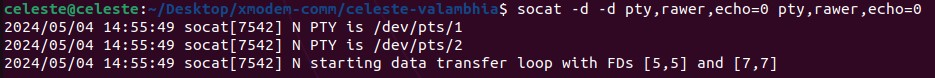

# Setup Virtual Serial Uart Port on Linux

* First install socat utility:
  ```
  sudo apt-get install socat
  ```

* Create two virtual serial ports with debug mode on:
  ```
  socat -d -d pty,rawer,echo=0 pty,rawer,echo=0
  ```
  

* For the initial proof of concept transfer files using the script `serial_transfer.sh` via the serial ports.

* To send file via port `/dev/pts/1` use the following command:
  ```
  ./serial_transfer.sh send images.jpeg /dev/pts/1
  ```

* To receive the file on another serial port `/dev/pts/2` use the following command:
  ```
  ./serial_transfer.sh receive images.jpeg /dev/pts/2
  ```

* FANTASTIC! We have two virtusl ports for serial UART communication for file transfer. Now we can utilize these ports to transfer files via xmodem protocol.